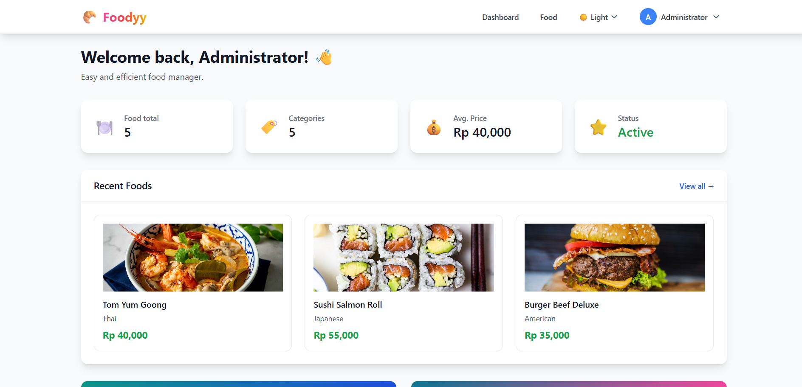

<h1 align="center"> Foodyy FoodManager </h1>

FoodManager is a comprehensive web application designed to help users efficiently manage their food inventory. It provides robust features for adding, editing, deleting, and viewing food items, complete with search, filtering, and pagination capabilities. The app also includes user authentication, profile management, and a dynamic theme switcher for a personalized experience.

## Features

-   **User Authentication:** Secure login and logout functionality with demo accounts.
-   **Food CRUD Operations:**
    -   **Add New Food:** Easily add new food items with details like name, category, price, description, and image.
    -   **View Food List:** Browse all food items with a clear, paginated list.
    -   **Edit Food:** Update existing food item details.
    -   **Delete Food:** Remove food items from the inventory.
-   **Search & Filter:** Efficiently find food items by name or description, and filter by category.
-   **Pagination:** Navigate through large lists of food items with intuitive pagination controls.
-   **User Profile Management:** Edit and update user's full name.
-   **Theme Switching:** Toggle between Light, Dark, and System themes for a comfortable viewing experience.
-   **Responsive Design:** A responsive and visually appealing design that adapts to various screen sizes.
-   **Local Storage Persistence:** All data (user authentication and food items) is persisted locally in the browser's local storage.
-   **Dashboard Overview:** A summary dashboard showing total foods, categories, average price, and recent additions.

## Technologies Used

-   **React:** A JavaScript library for building user interfaces.
-   **Vite:** A fast build tool that provides a lightning-fast development experience.
-   **TypeScript:** Adds type safety to JavaScript, improving code quality and maintainability.
-   **Tailwind CSS:** A utility-first CSS framework for rapidly building custom designs.
-   **React Router DOM:** For declarative routing in the application.
-   **Local Storage:** Used for client-side data persistence (authentication and food inventory).

## Getting Started

To run this project locally, follow these steps:

1.  **Clone the repository:**
    git clone [REPOSITORY_URL],
    cd food-management-app
2.  **Install dependencies:**
    npm install
3.  **Run the development server:**
    npm run dev
    The application will be available at `http://localhost:5173` (or another port if 5173 is in use).

## Demo Accounts

You can use the following demo accounts to log in:

-   **Username:** `admin` | **Password:** `admin123`

---

Feel free to contribute or provide feedback!
